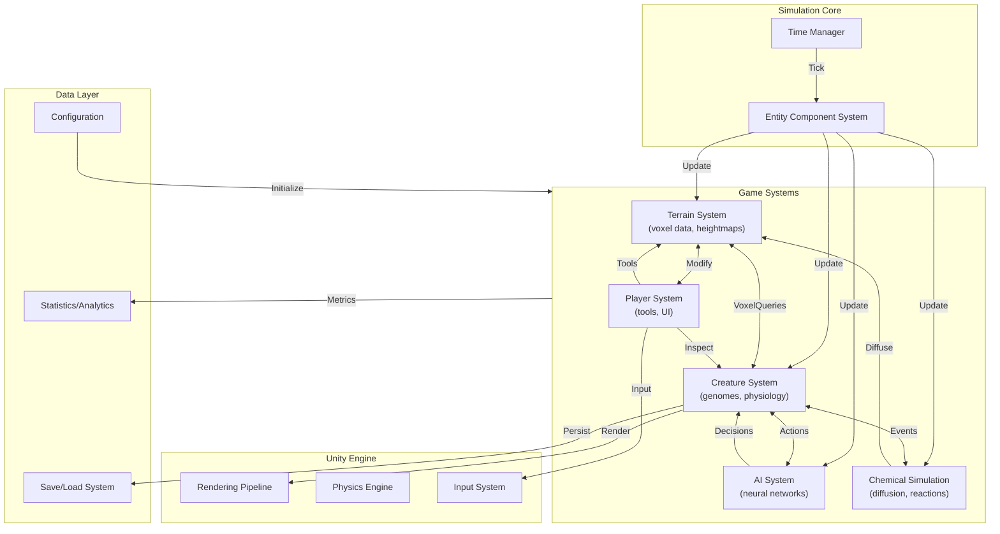

# Albia Reborn - System Architecture

> **Status:** Draft v0.1 | **Last Updated:** 2026-03-13  
> **Scope:** Week 1 Foundation — System Boundaries & Integration Points

---

## 1. System Overview

Albia Reborn is a Unity-based artificial life simulation game where creatures inhabit a dynamic, player-influenced world. The architecture follows a clean separation of concerns with well-defined interfaces between major systems.

### High-Level Architecture

```
┌─────────────────────────────────────────────────────────────────────────────┐
│                              UNITY ENGINE                                    │
│                    (Rendering, Physics, Input, Audio)                        │
└─────────────────────────────────────────────────────────────────────────────┘
                                      │
        ┌─────────────────────────────┼─────────────────────────────┐
        │                             │                             │
        ▼                             ▼                             ▼
┌───────────────┐           ┌───────────────┐           ┌───────────────┐
│   TERRAIN     │◄─────────►│   CREATURES   │◄─────────►│   AI/NEURAL   │
│   SYSTEM      │           │   SYSTEM      │           │   NETWORKS    │
└───────┬───────┘           └───────┬───────┘           └───────┬───────┘
        │                           │                           │
        │    ┌──────────────────────┼──────────────────────┐   │
        │    │                      ▼                      │   │
        │    │           ┌──────────────────┐            │   │
        │    └───────────►│   SIMULATION     │◄───────────┘   │
        │                │   CORE (ECS)     │                │
        │                └────────┬─────────┘                │
        │                         │                            │
        │              ┌──────────┴──────────┐                 │
        │              ▼                     ▼                 │
        │    ┌───────────────┐    ┌───────────────┐          │
        └────│    PLAYER    │    │   CHEMICAL    │──────────┘
             │   SYSTEM     │    │   SIMULATION  │
             └──────────────┘    └───────────────┘
```

---

## 2. System Boundaries

### 2.1 Terrain System
**Responsibility:** Voxel-based world generation, modification, and queries

**Boundaries:**
- **Receives from:** Player System (block placement/removal), Creature System (digging/burrowing)
- **Provides to:** Creature System (terrain queries for movement), AI System (environment observations)
- **Events:** VoxelChanged, BiomeChanged, ResourceDiscovered

**Data Flow:**
```
┌─────────────────────────────────────────────────────────────┐
│                      TERRAIN SYSTEM                           │
│                                                             │
│   Input:                                                    │
│   ├── PlayerAction (place/remove voxel)                    │
│   ├── CreatureAction (dig, eat terrain)                    │
│   └── Generation (procedural heightmaps)                     │
│                                                             │
│   Output:                                                   │
│   ├── ITerrainQuery (voxel type at position)               │
│   ├── IBiomeQuery (temperature, moisture, resources)       │
│   └── OnVoxelChanged event                                 │
└─────────────────────────────────────────────────────────────┘
```

### 2.2 Creature System
**Responsibility:** Organism lifecycle, genome expression, physiology, behavior execution

**Boundaries:**
- **Receives from:** AI System (action decisions), Terrain System (environmental data)
- **Provides to:** AI System (perception data), Player System (creature state for UI), Simulation Core (tick updates)
- **Events:** OnBirth, OnDeath, OnReproduce, OnChemicalChange

**Data Flow:**
```
┌─────────────────────────────────────────────────────────────┐
│                     CREATURE SYSTEM                           │
│                                                             │
│   Input:                                                    │
│   ├── GenomeData (DNA encoding)                            │
│   ├── ActionRequests from AI                               │
│   └── Environmental stimuli (from Terrain)                 │
│                                                             │
│   Output:                                                   │
│   ├── CreatureState (perception for AI)                    │
│   ├── OrganismEvents (birth, death, reproduce)             │
│   └── ChemicalInteractions (metabolism, emissions)        │
└─────────────────────────────────────────────────────────────┘
```

### 2.3 AI/Neural Network System
**Responsibility:** Brain simulation, decision making, learning/adaptation

**Boundaries:**
- **Receives from:** Creature System (sensor inputs), Player System (training signals if applicable)
- **Provides to:** Creature System (action outputs to execute)
- **Events:** OnDecisionMade, OnLearningOccurred

**Data Flow:**
```
┌─────────────────────────────────────────────────────────────┐
│                    AI/NEURAL SYSTEM                           │
│                                                             │
│   Input:                                                    │
│   ├── Float[] sensor inputs (from INeuralInputProvider)   │
│   └── Reward signals (from environment feedback)          │
│                                                             │
│   Output:                                                   │
│   ├── ActionIndex + Strength (to INeuralOutputConsumer)   │
│   └── BrainState (for persistence, analysis)              │
└─────────────────────────────────────────────────────────────┘
```

### 2.4 Player System
**Responsibility:** User interaction, god-mode tools, creature observation, world modification

**Boundaries:**
- **Receives from:** Unity Input System, Creature System (creature data for inspection)
- **Provides to:** Terrain System (modification commands), Creature System (directed interventions if applicable)
- **Events:** OnPlayerAction, OnCreatureInspected, OnToolUsed

---

## 3. Dependency Graph

### 3.1 Direct Dependencies (Solid Lines)
```
                    ┌─────────────┐
                    │   Player    │
                    └──────┬──────┘
                           │
            ┌──────────────┼──────────────┐
            │              │              │
            ▼              ▼              ▼
      ┌─────────┐    ┌─────────┐   ┌─────────┐
      │ Terrain │◄──►│Creature │◄──►│   AI    │
      │ System  │    │ System  │   │System   │
      └────┬────┘    └────┬────┘   └────┬────┘
           │              │              │
           └──────────────┼──────────────┘
                          ▼
                   ┌─────────────┐
                   │ Simulation  │
                   │   Core      │
                   └─────────────┘
```

### 3.2 Interface Contract Dependency Table

| Consumer ↓ / Provider → | Terrain | Creatures | AI | Player |
|---------------------------|---------|-----------|-----|--------|
| **Terrain**               | —       | Read-only | N/A | Writes |
| **Creatures**             | Queries | Internal  | Consumes | Events |
| **AI**                    | N/A     | Reads     | Internal | N/A |
| **Player**                | Modifies| Observes  | N/A | — |
| **Simulation Core**       | Ticks   | Ticks     | Ticks | Ticks |

### 3.3 Event Bus System

All major systems communicate via a central Event Bus:

```csharp
public interface IEventBus {
    void Publish<T>(T eventData) where T : ISimulationEvent;
    void Subscribe<T>(Action<T> handler) where T : ISimulationEvent;
    void Unsubscribe<T>(Action<T> handler) where T : ISimulationEvent;
}

// Key Events
event SimulationTickEvent      // Fired each simulation step
event VoxelChangedEvent        // Terrain modification
event CreatureBornEvent        // New organism created
event CreatureDeathEvent       // Organism died
event ReproductionEvent        // New offspring produced
```

---

## 4. Data Flow Diagram (Mermaid)



---

## 5. Integration Points Summary

| Integration | Type | Direction | Data Format |
|-------------|------|-----------|-------------|
| Terrain ↔ Creatures | Query + Events | Bidirectional | `ITerrainQuery` interface, `OnVoxelChanged` events |
| Creatures ↔ AI | Perception + Actions | Bidirectional | `float[]` inputs, `int action + float strength` outputs |
| Player ↔ Terrain | Commands | Unidirectional (Player → Terrain) | `SetVoxel` commands |
| Player ↔ Creatures | Observation | Unidirectional (Creatures → Player) | Read-only `IOrganism` data |
| Simulation Core ↔ All | Tick Updates | Unidirectional (Core → Systems) | `IUpdateable` interface |
| Chemical ↔ Creatures | Emissions/Absorption | Bidirectional | Chemical concentration values |

---

## 6. Future Considerations

### Planned Systems (Week 2+)
- **Save/Load System**: Serialization of world state
- **Network Multiplayer**: Synchronized creature observations
- **Modding API**: External creature/brain definitions
- **Analytics Pipeline**: Population dynamics analysis

### Performance Constraints
- Target: 60 FPS with 100+ creatures
- Terrain: Chunk-based LOD system
- AI: Neural networks limited to ~100 neurons per creature
- ECS: Burst compiler + Job System for parallel updates

---

## 7. Document History

| Version | Date | Author | Changes |
|---------|------|--------|---------|
| 0.1 | 2026-03-13 | Integration Architect | Initial architecture draft |

---

*This architecture prioritizes clean interfaces over early optimization. Systems communicate through well-defined contracts, enabling parallel development and future extensibility.*
